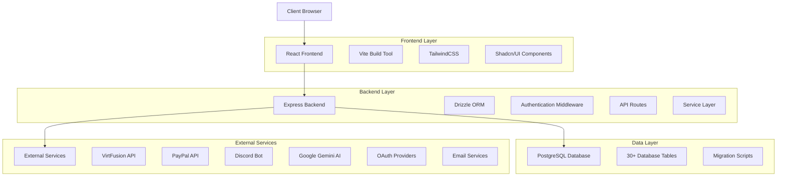

# SkyPANEL System Architecture

This document provides a comprehensive overview of the SkyPANEL system architecture, including component interactions, data flow, and integration points.

## Table of Contents

1. [Architecture Overview](#architecture-overview)
2. [System Components](#system-components)
3. [Data Flow](#data-flow)
4. [Integration Points](#integration-points)
5. [Authentication Flow](#authentication-flow)
6. [Deployment Architecture](#deployment-architecture)
7. [Security Architecture](#security-architecture)
8. [Database Schema](#database-schema)
9. [Scalability Considerations](#scalability-considerations)
10. [Known Limitations](#known-limitations)

## Architecture Overview

SkyPANEL (v14.0.0) follows a modern web application architecture with a clear separation between frontend and backend components. The system is built using a Node.js/Express backend with a React frontend, communicating via RESTful APIs and real-time WebSocket connections.

### High-Level Architecture Diagram



The architecture follows these key principles:

1. **Separation of Concerns**: Clear separation between UI, business logic, and data access
2. **API-First Design**: All functionality exposed through well-defined APIs
3. **Stateless Backend**: Server maintains minimal state, with client sessions stored in the database
4. **Responsive Design**: Frontend adapts to different device sizes and orientations
5. **Security by Design**: Security considerations built into all layers of the application
6. **Modular Structure**: Organized codebase with shared schemas and reusable components

## System Components

### Client Layer

The client layer is built with React 18 and TypeScript, providing a responsive and interactive user interface.

#### Key Technologies:

* **React 18**: Modern React with concurrent features and hooks

* **TypeScript**: Type-safe development with strict typing

* **Vite**: Fast build tool and development server

* **TailwindCSS**: Utility-first CSS framework with custom theming

* **Shadcn/UI**: Component library built on Radix UI primitives

* **Wouter**: Lightweight client-side routing

* **TanStack Query**: Server state management and caching

* **React Hook Form**: Form handling with validation

* **Framer Motion**: Animation library for smooth transitions

#### Project Structure:

```
client/
├── src/
│   ├── components/          # Reusable UI components
│   │   ├── ui/             # Base UI components (Shadcn/UI)
│   │   ├── auth/           # Authentication components
│   │   ├── dashboard/      # Dashboard-specific components
│   │   ├── admin/          # Admin interface components
│   │   └── layout/         # Layout components
│   ├── pages/              # Page components
│   ├── hooks/              # Custom React hooks
│   ├── lib/                # Utility libraries and configurations
│   └── types/              # TypeScript type definitions
├── public/                 # Static assets
└── index.html             # Entry HTML file
```

### Server Layer

The server layer is built with Node.js and Express, providing RESTful APIs and business logic.

#### Key Technologies:

* **Node.js 18+**: JavaScript runtime with ES modules

* **Express**: Web application framework

* **TypeScript**: Type-safe server development

* **Drizzle ORM**: Type-safe database access layer

* **Zod**: Runtime type validation

* **Passport.js**: Authentication middleware

* **Discord.js**: Discord bot integration

* **Node-cron**: Scheduled task management

#### Project Structure:

```
server/
├── routes/                 # API route definitions
├── services/               # Business logic services
│   ├── auth/              # Authentication services
│   ├── communication/     # Email and Discord services
│   └── infrastructure/    # Infrastructure
```

