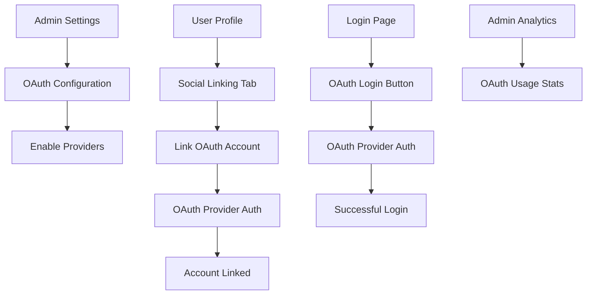

# OAuth SSO System Requirements for SkyPANEL

## 1. Product Overview

Implement a comprehensive OAuth Single Sign-On (SSO) system for SkyPANEL that allows existing users to link their social accounts and login using OAuth providers (Discord, GitHub, Google, LinkedIn). This system is separate from the existing VirtFusion SSO and focuses on enhancing user authentication options.

The OAuth SSO system will provide administrators with centralized control over OAuth provider configurations and give users the flexibility to link multiple social accounts to their existing SkyPANEL accounts for convenient login access.

## 2. Core Features

### 2.1 User Roles

| Role          | Registration Method     | Core Permissions                                            |
| ------------- | ----------------------- | ----------------------------------------------------------- |
| Administrator | Existing admin accounts | Can configure OAuth provider settings, view OAuth analytics |
| Client User   | Existing user accounts  | Can link/unlink social accounts, login via OAuth providers  |

### 2.2 Feature Module

Our OAuth SSO system consists of the following main pages:

1. **Admin OAuth Settings Page**: OAuth provider configuration, application credentials management, OAuth analytics dashboard.
2. **User Profile Social Linking Tab**: Social account linking/unlinking, linked accounts overview, account status management.
3. **Enhanced Auth Login Page**: OAuth login buttons, provider selection, seamless authentication flow.

### 2.3 Page Details

| Page Name            | Module Name                | Feature description                                                                                                     |
| -------------------- | -------------------------- | ----------------------------------------------------------------------------------------------------------------------- |
| Admin OAuth Settings | Provider Configuration     | Configure OAuth application credentials (Client ID, Client Secret, Redirect URLs) for Discord, GitHub, Google, LinkedIn |
| Admin OAuth Settings | OAuth Analytics            | View OAuth login statistics, linked accounts count, provider usage metrics                                              |
| Admin OAuth Settings | Provider Status Management | Enable/disable OAuth providers, test OAuth connections, manage provider settings                                        |
| User Profile         | Social Linking Tab         | Link existing user accounts to OAuth providers (Discord, GitHub, Google, LinkedIn)                                      |
| User Profile         | Linked Accounts Management | View linked social accounts, unlink accounts, manage account preferences                                                |
| User Profile         | Account Security           | View OAuth login history, manage OAuth permissions, security notifications                                              |
| Auth Login Page      | OAuth Login Buttons        | Display enabled OAuth provider login buttons with proper branding                                                       |
| Auth Login Page      | OAuth Authentication Flow  | Handle OAuth callback, user authentication, account linking validation                                                  |
| Auth Login Page      | Login Method Selection     | Allow users to choose between traditional login and OAuth providers                                                     |

## 3. Core Process

**Administrator Flow:**

1. Admin navigates to Admin Settings → OAuth SSO Settings
2. Admin configures OAuth provider credentials (Client ID, Secret, etc.)
3. Admin enables/disables specific OAuth providers
4. Admin monitors OAuth usage analytics and user linking statistics

**User Account Linking Flow:**

1. User navigates to Profile → Social Linking tab
2. User selects OAuth provider to link (Discord, GitHub, Google, LinkedIn)
3. User is redirected to OAuth provider for authorization
4. Upon successful authorization, account is linked to user profile
5. User can manage linked accounts and unlink if needed

**OAuth Login Flow:**

1. User visits login page and sees enabled OAuth provider buttons
2. User clicks on preferred OAuth provider button
3. User is redirected to OAuth provider for authentication
4. Upon successful authentication, user is logged into SkyPANEL
5. System validates linked account and grants access

## 4. User Interface Design

### 4.1 Design Style

* **Primary Colors**: Follow SkyPANEL brand theme (configurable via admin settings)

* **Button Style**: Rounded corners with provider-specific branding colors

* **Font**: Inter font family with 14px base size for OAuth elements

* **Layout Style**: Card-based design with clear visual hierarchy

* **OAuth Provider Icons**: Official brand icons for Discord, GitHub, Google, LinkedIn

* **Animation**: Subtle hover effects and loading states for OAuth interactions

### 4.2 Page Design Overview

| Page Name            | Module Name            | UI Elements                                                                                                                       |
| -------------------- | ---------------------- | --------------------------------------------------------------------------------------------------------------------------------- |
| Admin OAuth Settings | Provider Configuration | Card layout with provider logos, toggle switches for enable/disable, secure input fields for credentials, test connection buttons |
| Admin OAuth Settings | Analytics Dashboard    | Statistics cards showing login counts, charts for provider usage, recent OAuth activity table                                     |
| User Profile         | Social Linking Tab     | Provider cards with link/unlink buttons, connection status indicators, linked account information display                         |
| Auth Login Page      | OAuth Buttons          | Branded provider buttons with icons, "Continue with \[Provider]" text, proper spacing and alignment                               |
| Auth Login Page      | Login Options          | Clear separation between traditional login and OAuth options, "OR" divider element                                                |

### 4.3 Responsiveness

The OAuth SSO system is designed mobile-first with responsive breakpoints. OAuth provider buttons stack vertically on mobile devices, and admin configuration forms adapt to smaller screens with collapsible sections. Touch interaction is optimized for mobile OAuth authentication flows.

## 5. Technical Implementation Notes

### 5.1 Database Schema Requirements

* **oauth\_providers table**: Store OAuth provider configurations (provider\_name, client\_id, client\_secret, enabled, etc.)

* **user\_oauth\_accounts table**: Link users to their OAuth accounts (user\_id, provider\_name, provider\_user\_id, etc.)

* **oauth\_login\_logs table**: Track OAuth login attempts and success rates

### 5.2 Security Considerations

* OAuth credentials stored securely with encryption

* CSRF protection for OAuth flows

* State parameter validation for OAuth callbacks

* Rate limiting for OAuth login attempts

* Secure redirect URL validation

### 5.3 Integration Points

* Express.js routes for OAuth callbacks

* Passport.js strategies for each OAuth provider

* React components for OAuth UI elements

* Database migrations for OAuth schema

* Admin middleware for OAuth settings access

