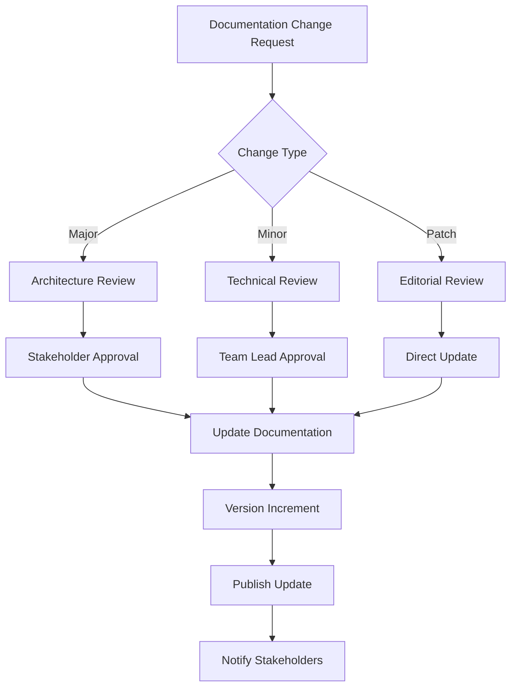
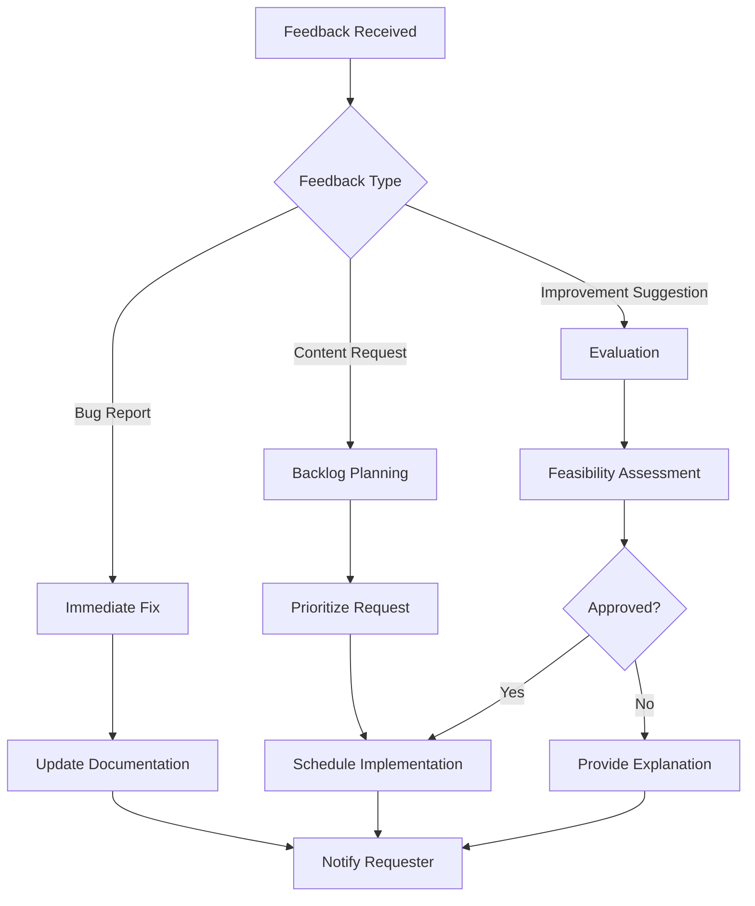

# Trae AI Documentation Index

## 📚 Documentation Overview

This comprehensive documentation suite provides everything needed to understand, implement, deploy, and maintain Trae AI systems. The documentation is organized into four main categories, each serving specific audiences and use cases.

## 🗂️ Documentation Structure

### 1. Technical Specifications
**File**: `trae-ai-technical-specifications.md`

**Purpose**: Comprehensive technical documentation covering system architecture, components, and requirements.

**Target Audience**:
- System Architects
- DevOps Engineers
- Technical Decision Makers
- Infrastructure Teams

**Key Sections**:
- System Architecture Overview
- Technical Components
- Performance Specifications
- Integration Capabilities
- Data Management
- Scalability & Deployment
- Monitoring & Observability
- Security Specifications
- Development & Testing
- Maintenance & Updates

**When to Use**:
- Planning system architecture
- Evaluating technical requirements
- Designing infrastructure
- Setting up monitoring and observability

---

### 2. API Reference
**File**: `trae-ai-api-reference.md`

**Purpose**: Complete API documentation with endpoints, parameters, response formats, and integration examples.

**Target Audience**:
- Frontend Developers
- Backend Developers
- Integration Engineers
- QA Engineers

**Key Sections**:
- API Overview & Authentication
- Conversation Endpoints
- Tool Integration Endpoints
- File Management Endpoints
- Analytics Endpoints
- Error Handling
- SDKs and Libraries
- Webhooks

**When to Use**:
- Integrating with Trae AI APIs
- Building client applications
- Implementing webhooks
- Troubleshooting API issues

---

### 3. Usage Examples and Tutorials
**File**: `trae-ai-usage-examples.md`

**Purpose**: Practical implementation examples, tutorials, and code samples for common use cases.

**Target Audience**:
- Application Developers
- Solution Architects
- Technical Consultants
- Implementation Teams

**Key Sections**:
- Getting Started Guide
- Common Use Cases
- Advanced Integration Patterns
- Error Handling and Best Practices
- Testing and Debugging

**When to Use**:
- Learning how to use Trae AI
- Implementing specific use cases
- Following best practices
- Debugging integration issues

---

### 4. Steering Guidelines
**File**: `trae-ai-steering-guidelines.md`

**Purpose**: Best practices, implementation strategies, and governance protocols for optimal AI deployment.

**Target Audience**:
- Product Managers
- Engineering Managers
- Compliance Officers
- Executive Leadership
- AI Ethics Teams

**Key Sections**:
- Implementation Best Practices
- Deployment Strategies
- Governance Protocols
- Security Framework
- Performance Optimization
- Compliance and Ethics
- Maintenance and Updates

**When to Use**:
- Establishing AI governance
- Planning deployments
- Ensuring compliance
- Optimizing performance
- Managing AI ethics

## 🔍 Quick Reference Guide

### Finding Information by Role

#### For Developers
1. **Start with**: API Reference → Usage Examples
2. **Key Documents**: 
   - API Reference (endpoints and integration)
   - Usage Examples (code samples and tutorials)
   - Technical Specifications (architecture understanding)

#### For DevOps/Infrastructure Teams
1. **Start with**: Technical Specifications → Steering Guidelines
2. **Key Documents**:
   - Technical Specifications (system requirements)
   - Steering Guidelines (deployment strategies)
   - API Reference (monitoring endpoints)

#### For Product/Project Managers
1. **Start with**: Steering Guidelines → Technical Specifications
2. **Key Documents**:
   - Steering Guidelines (governance and best practices)
   - Technical Specifications (capabilities and limitations)
   - Usage Examples (implementation possibilities)

#### For Compliance/Security Teams
1. **Start with**: Steering Guidelines (Security & Compliance sections)
2. **Key Documents**:
   - Steering Guidelines (security framework and compliance)
   - Technical Specifications (security specifications)
   - API Reference (authentication and authorization)

### Finding Information by Task

#### Setting Up Trae AI
1. Technical Specifications → System Requirements
2. Steering Guidelines → Implementation Best Practices
3. Usage Examples → Getting Started Guide
4. API Reference → Authentication

#### Integrating with Applications
1. API Reference → Authentication & Endpoints
2. Usage Examples → Common Use Cases
3. Technical Specifications → Integration Capabilities
4. Steering Guidelines → Security Framework

#### Deploying to Production
1. Steering Guidelines → Deployment Strategies
2. Technical Specifications → Scalability & Deployment
3. API Reference → Rate Limiting & Error Handling
4. Usage Examples → Error Handling Best Practices

#### Monitoring and Maintenance
1. Technical Specifications → Monitoring & Observability
2. Steering Guidelines → Maintenance and Updates
3. API Reference → Analytics Endpoints
4. Usage Examples → Testing and Debugging

## 📋 Documentation Maintenance Guidelines

### Update Frequency

| Document Type | Update Frequency | Trigger Events |
|---------------|------------------|----------------|
| Technical Specifications | Quarterly | Major architecture changes, new components |
| API Reference | Monthly | API changes, new endpoints, deprecations |
| Usage Examples | Bi-monthly | New use cases, framework updates |
| Steering Guidelines | Quarterly | Policy changes, compliance updates |

### Version Control

#### Versioning Strategy
- **Major Version** (X.0.0): Significant architectural changes or breaking API changes
- **Minor Version** (X.Y.0): New features, new endpoints, or significant content additions
- **Patch Version** (X.Y.Z): Bug fixes, clarifications, or minor updates

#### Change Management Process



### Quality Assurance

#### Documentation Review Checklist

**Technical Accuracy**
- [ ] Code examples are tested and working
- [ ] API endpoints and parameters are current
- [ ] Architecture diagrams reflect current state
- [ ] Performance metrics are up-to-date

**Clarity and Usability**
- [ ] Content is clear and well-organized
- [ ] Examples are relevant and practical
- [ ] Navigation is intuitive
- [ ] Search functionality works effectively

**Completeness**
- [ ] All features are documented
- [ ] Error scenarios are covered
- [ ] Security considerations are addressed
- [ ] Compliance requirements are included

**Consistency**
- [ ] Terminology is consistent across documents
- [ ] Formatting follows style guide
- [ ] Cross-references are accurate
- [ ] Version information is current

### Content Guidelines

#### Writing Standards

**Tone and Style**
- Use clear, concise language
- Write in active voice
- Use present tense
- Avoid jargon without explanation
- Include practical examples

**Structure**
- Use hierarchical headings (H1-H6)
- Include table of contents for long documents
- Use bullet points and numbered lists
- Include code blocks with syntax highlighting
- Add diagrams and visual aids where helpful

**Code Examples**
- Provide complete, runnable examples
- Include error handling
- Use consistent coding style
- Add comments for complex logic
- Test all code examples before publishing

#### Accessibility

**Visual Accessibility**
- Use sufficient color contrast
- Provide alt text for images
- Use descriptive link text
- Ensure content is readable without color

**Structural Accessibility**
- Use semantic HTML headings
- Provide skip navigation links
- Include ARIA labels where appropriate
- Ensure keyboard navigation works

### Search and Navigation

#### Search Optimization

**Keywords and Tags**
- Include relevant keywords in headings
- Use consistent terminology
- Add metadata tags
- Create comprehensive index

**Cross-References**
- Link related sections
- Include "See also" sections
- Maintain bidirectional links
- Update links when content moves

#### Navigation Structure

```
Trae AI Documentation
├── 📖 Getting Started
│   ├── Quick Start Guide
│   ├── Installation
│   └── First Steps
├── 🔧 Technical Documentation
│   ├── System Architecture
│   ├── API Reference
│   └── Integration Guide
├── 💡 Usage Examples
│   ├── Common Use Cases
│   ├── Advanced Patterns
│   └── Best Practices
├── 🎯 Steering Guidelines
│   ├── Implementation
│   ├── Governance
│   └── Compliance
└── 🔍 Reference
    ├── Glossary
    ├── FAQ
    └── Troubleshooting
```

## 🔄 Feedback and Improvement

### Feedback Collection

#### Feedback Channels
- **Documentation Issues**: GitHub issues or internal ticketing system
- **Content Requests**: Feature request forms
- **User Surveys**: Quarterly documentation satisfaction surveys
- **Analytics**: Page views, search queries, bounce rates

#### Feedback Processing



### Continuous Improvement

#### Metrics and KPIs

**Usage Metrics**
- Page views and unique visitors
- Time spent on pages
- Search query analysis
- Download counts

**Quality Metrics**
- User satisfaction scores
- Feedback response time
- Documentation coverage
- Accuracy of information

**Effectiveness Metrics**
- Support ticket reduction
- Implementation success rate
- Time to first success
- Developer onboarding time

#### Regular Reviews

**Monthly Reviews**
- Analytics review
- Feedback analysis
- Content gap identification
- Quick fixes and updates

**Quarterly Reviews**
- Comprehensive content audit
- User journey analysis
- Technology stack updates
- Strategic planning

**Annual Reviews**
- Complete documentation overhaul
- Information architecture review
- Tool and platform evaluation
- Long-term roadmap planning

## 📞 Support and Contact

### Documentation Team
- **Technical Writers**: Content creation and maintenance
- **Developer Advocates**: Technical accuracy and examples
- **UX Designers**: Information architecture and usability
- **Product Managers**: Strategic direction and prioritization

### Getting Help

**For Technical Issues**
- Check the Troubleshooting section
- Search existing documentation
- Submit a support ticket
- Join community forums

**For Documentation Issues**
- Report bugs or inaccuracies
- Request new content
- Suggest improvements
- Contribute to documentation

### Contributing

**How to Contribute**
1. Identify documentation gaps or issues
2. Follow the contribution guidelines
3. Submit pull requests or suggestions
4. Participate in review process
5. Help maintain accuracy and quality

**Contribution Guidelines**
- Follow the style guide
- Test all code examples
- Include proper attribution
- Respect licensing requirements
- Maintain professional tone

---

## 📈 Documentation Roadmap

### Short-term Goals (Next 3 months)
- [ ] Implement search functionality improvements
- [ ] Add interactive code examples
- [ ] Create video tutorials for key workflows
- [ ] Enhance mobile responsiveness
- [ ] Establish automated testing for code examples

### Medium-term Goals (3-6 months)
- [ ] Develop comprehensive glossary
- [ ] Create role-based documentation paths
- [ ] Implement user feedback system
- [ ] Add multi-language support
- [ ] Integrate with development workflow

### Long-term Goals (6+ months)
- [ ] AI-powered documentation assistance
- [ ] Interactive documentation platform
- [ ] Community contribution system
- [ ] Advanced analytics and personalization
- [ ] Integration with learning management systems

This documentation index serves as the central hub for all Trae AI documentation, providing clear navigation, maintenance guidelines, and continuous improvement processes to ensure the documentation remains current, accurate, and valuable for all users.