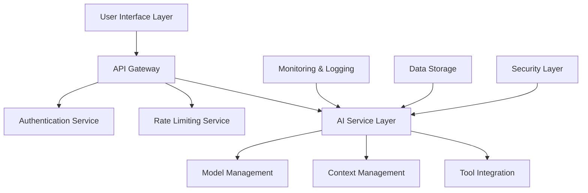
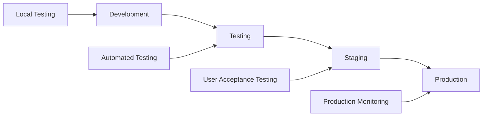
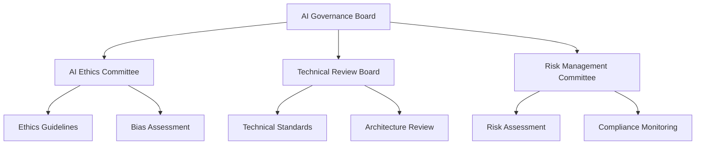
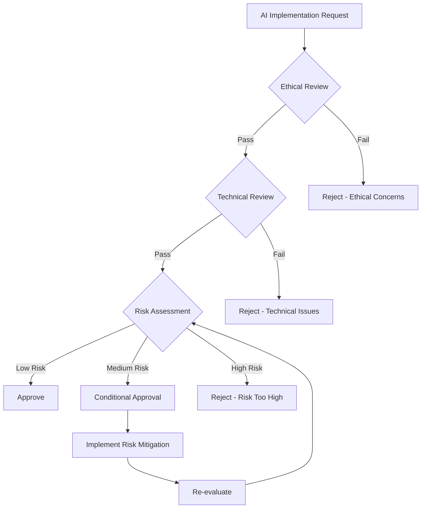
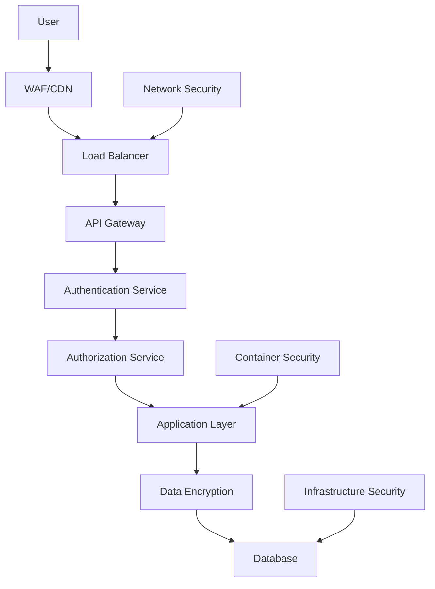

# Trae AI Steering Guidelines

## 1. Introduction and Purpose

### 1.1 Overview

This document provides comprehensive steering guidelines for implementing, deploying, and managing Trae AI systems effectively. These guidelines ensure optimal performance, security, compliance, and user experience while maintaining ethical AI practices.

### 1.2 Scope

These guidelines cover:

* Implementation best practices

* Deployment strategies

* Governance protocols

* Security frameworks

* Performance optimization

* Ethical AI considerations

* Compliance requirements

* Monitoring and maintenance

### 1.3 Target Audience

* AI Engineers and Developers

* DevOps Teams

* Product Managers

* Security Officers

* Compliance Teams

* Executive Leadership

## 2. Implementation Best Practices

### 2.1 Planning and Design

#### 2.1.1 Requirements Analysis

**Before Implementation:**

* Define clear use cases and success metrics

* Identify target users and their needs

* Assess technical requirements and constraints

* Evaluate data sources and quality

* Determine integration points with existing systems

**Checklist:**

* [ ] Business objectives clearly defined

* [ ] Technical requirements documented

* [ ] Data governance plan established

* [ ] Security requirements identified

* [ ] Compliance requirements understood

* [ ] Resource allocation planned

* [ ] Timeline and milestones defined

#### 2.1.2 Architecture Design

**Recommended Architecture Patterns:**



**Key Principles:**

* **Modularity**: Design loosely coupled components

* **Scalability**: Plan for horizontal scaling

* **Resilience**: Implement fault tolerance and recovery

* **Security**: Apply defense-in-depth strategies

* **Observability**: Include comprehensive monitoring

### 2.2 Development Guidelines

#### 2.2.1 Code Quality Standards

**Python Example:**

```python
class AIServiceManager:
    """
    Manages AI service interactions with proper error handling,
    logging, and resource management.
    """
    
    def __init__(self, config: AIConfig):
        self.config = config
        self.logger = self._setup_logging()
        self.metrics = self._setup_metrics()
        self.client = self._initialize_client()
    
    def process_request(self, request: AIRequest) -> AIResponse:
        """
        Process AI request with comprehensive error handling
        """
        request_id = self._generate_request_id()
        
        try:
            # Validate input
            self._validate_request(request)
            
            # Log request
            self.logger.info(f"Processing request {request_id}", extra={
                "request_id": request_id,
                "user_id": request.user_id,
                "model": request.model
            })
            
            # Process with timeout
            with self._timeout_context(self.config.request_timeout):
                response = self._execute_ai_request(request)
            
            # Log success
            self.metrics.increment("requests.success")
            self.logger.info(f"Request {request_id} completed successfully")
            
            return response
            
        except ValidationError as e:
            self.metrics.increment("requests.validation_error")
            self.logger.warning(f"Validation error for request {request_id}: {e}")
            raise AIValidationError(str(e))
            
        except TimeoutError as e:
            self.metrics.increment("requests.timeout")
            self.logger.error(f"Timeout for request {request_id}: {e}")
            raise AITimeoutError("Request timed out")
            
        except Exception as e:
            self.metrics.increment("requests.error")
            self.logger.error(f"Unexpected error for request {request_id}: {e}")
            raise AIServiceError("Internal service error")
```

#### 2.2.2 Configuration Management

**Environment-Specific Configuration:**

```yaml
# config/production.yaml
ai_service:
  model_settings:
    default_model: "gpt-4"
    temperature: 0.7
    max_tokens: 2048
    timeout: 30
  
  rate_limiting:
    requests_per_minute: 1000
    burst_limit: 100
  
  security:
    api_key_rotation_days: 30
    encryption_key: "${AI_ENCRYPTION_KEY}"
    allowed_origins: ["https://app.company.com"]
  
  monitoring:
    log_level: "INFO"
    metrics_enabled: true
    tracing_enabled: true
    alert_thresholds:
      error_rate: 0.05
      response_time_p95: 2000
```

### 2.3 Testing Strategy

#### 2.3.1 Testing Pyramid

```mermaid
pyramid
    title Testing Strategy
    "Unit Tests (70%)" : 70
    "Integration Tests (20%)" : 20
    "E2E Tests (10%)" : 10
```

**Unit Testing:**

```python
import pytest
from unittest.mock import Mock, patch

class TestAIServiceManager:
    
    @pytest.fixture
    def ai_service(self):
        config = Mock()
        config.request_timeout = 30
        return AIServiceManager(config)
    
    def test_process_request_success(self, ai_service):
        # Arrange
        request = AIRequest(user_id="user123", message="test")
        expected_response = AIResponse(content="response")
        
        with patch.object(ai_service, '_execute_ai_request') as mock_execute:
            mock_execute.return_value = expected_response
            
            # Act
            result = ai_service.process_request(request)
            
            # Assert
            assert result == expected_response
            mock_execute.assert_called_once_with(request)
    
    def test_process_request_validation_error(self, ai_service):
        # Arrange
        invalid_request = AIRequest(user_id="", message="")
        
        # Act & Assert
        with pytest.raises(AIValidationError):
            ai_service.process_request(invalid_request)
```

**Integration Testing:**

```python
def test_ai_service_integration():
    """
    Test full AI service integration
    """
    # Setup test environment
    test_config = load_test_config()
    ai_service = AIServiceManager(test_config)
    
    # Test conversation flow
    conversation = ai_service.create_conversation("Integration Test")
    response = ai_service.send_message(
        conversation.id,
        "This is an integration test message"
    )
    
    # Assertions
    assert response.content is not None
    assert len(response.content) > 0
    assert response.tokens_used > 0
    
    # Cleanup
    ai_service.delete_conversation(conversation.id)
```

## 3. Deployment Strategies

### 3.1 Environment Management

#### 3.1.1 Environment Progression



**Environment Specifications:**

| Environment | Purpose                   | Configuration                    | Data                       |
| ----------- | ------------------------- | -------------------------------- | -------------------------- |
| Development | Feature development       | Minimal resources, mock services | Synthetic data             |
| Testing     | Automated testing         | CI/CD integration                | Test datasets              |
| Staging     | Pre-production validation | Production-like setup            | Anonymized production data |
| Production  | Live system               | Full resources, monitoring       | Real user data             |

#### 3.1.2 Deployment Patterns

**Blue-Green Deployment:**

```yaml
# deployment/blue-green.yaml
apiVersion: apps/v1
kind: Deployment
metadata:
  name: trae-ai-blue
  labels:
    version: blue
spec:
  replicas: 3
  selector:
    matchLabels:
      app: trae-ai
      version: blue
  template:
    metadata:
      labels:
        app: trae-ai
        version: blue
    spec:
      containers:
      - name: trae-ai
        image: trae-ai:v1.2.0
        ports:
        - containerPort: 8080
        env:
        - name: ENVIRONMENT
          value: "production"
        - name: VERSION
          value: "blue"
---
apiVersion: v1
kind: Service
metadata:
  name: trae-ai-service
spec:
  selector:
    app: trae-ai
    version: blue  # Switch to green for deployment
  ports:
  - port: 80
    targetPort: 8080
```

**Canary Deployment:**

```yaml
# Istio VirtualService for canary deployment
apiVersion: networking.istio.io/v1alpha3
kind: VirtualService
metadata:
  name: trae-ai-canary
spec:
  http:
  - match:
    - headers:
        canary:
          exact: "true"
    route:
    - destination:
        host: trae-ai-service
        subset: v2
  - route:
    - destination:
        host: trae-ai-service
        subset: v1
      weight: 90
    - destination:
        host: trae-ai-service
        subset: v2
      weight: 10
```

### 3.2 Infrastructure as Code

#### 3.2.1 Terraform Configuration

```hcl
# infrastructure/main.tf
module "trae_ai_infrastructure" {
  source = "./modules/trae-ai"
  
  environment = var.environment
  region      = var.aws_region
  
  # Compute resources
  instance_type = var.environment == "production" ? "c5.2xlarge" : "t3.medium"
  min_capacity  = var.environment == "production" ? 3 : 1
  max_capacity  = var.environment == "production" ? 10 : 3
  
  # Database configuration
  db_instance_class = var.environment == "production" ? "db.r5.xlarge" : "db.t3.micro"
  db_multi_az      = var.environment == "production" ? true : false
  
  # Security
  enable_encryption = true
  backup_retention  = var.environment == "production" ? 30 : 7
  
  # Monitoring
  enable_detailed_monitoring = var.environment == "production" ? true : false
  
  tags = {
    Environment = var.environment
    Project     = "trae-ai"
    Owner       = "ai-team"
  }
}
```

#### 3.2.2 Kubernetes Manifests

```yaml
# k8s/deployment.yaml
apiVersion: apps/v1
kind: Deployment
metadata:
  name: trae-ai
  namespace: ai-services
spec:
  replicas: 3
  strategy:
    type: RollingUpdate
    rollingUpdate:
      maxSurge: 1
      maxUnavailable: 0
  selector:
    matchLabels:
      app: trae-ai
  template:
    metadata:
      labels:
        app: trae-ai
    spec:
      containers:
      - name: trae-ai
        image: trae-ai:latest
        ports:
        - containerPort: 8080
        resources:
          requests:
            memory: "512Mi"
            cpu: "250m"
          limits:
            memory: "1Gi"
            cpu: "500m"
        livenessProbe:
          httpGet:
            path: /health
            port: 8080
          initialDelaySeconds: 30
          periodSeconds: 10
        readinessProbe:
          httpGet:
            path: /ready
            port: 8080
          initialDelaySeconds: 5
          periodSeconds: 5
        env:
        - name: DATABASE_URL
          valueFrom:
            secretKeyRef:
              name: trae-ai-secrets
              key: database-url
        - name: API_KEY
          valueFrom:
            secretKeyRef:
              name: trae-ai-secrets
              key: api-key
```

## 4. Governance Protocols

### 4.1 AI Governance Framework

#### 4.1.1 Governance Structure



**Roles and Responsibilities:**

| Role                      | Responsibilities                     | Authority                      |
| ------------------------- | ------------------------------------ | ------------------------------ |
| AI Governance Board       | Strategic oversight, policy approval | Final decision authority       |
| AI Ethics Committee       | Ethical guidelines, bias review      | Veto power on ethical concerns |
| Technical Review Board    | Technical standards, architecture    | Technical approval authority   |
| Risk Management Committee | Risk assessment, compliance          | Risk mitigation authority      |

#### 4.1.2 Decision Framework

**AI Implementation Decision Tree:**



### 4.2 Model Management

#### 4.2.1 Model Lifecycle Management

**Stages:**

1. **Development**: Model training and initial validation
2. **Testing**: Comprehensive testing and validation
3. **Staging**: Pre-production deployment and testing
4. **Production**: Live deployment with monitoring
5. **Monitoring**: Continuous performance monitoring
6. **Retirement**: Model deprecation and replacement

**Model Registry:**

```python
class ModelRegistry:
    """
    Centralized model management and versioning
    """
    
    def register_model(self, model_info: ModelInfo) -> str:
        """
        Register a new model version
        """
        # Validate model
        self._validate_model(model_info)
        
        # Store model metadata
        model_id = self._generate_model_id()
        self._store_metadata(model_id, model_info)
        
        # Store model artifacts
        self._store_artifacts(model_id, model_info.artifacts)
        
        # Update model lineage
        self._update_lineage(model_id, model_info)
        
        return model_id
    
    def promote_model(self, model_id: str, target_stage: str) -> bool:
        """
        Promote model to next stage
        """
        # Validate promotion criteria
        if not self._validate_promotion(model_id, target_stage):
            return False
        
        # Update model stage
        self._update_model_stage(model_id, target_stage)
        
        # Trigger deployment if promoting to production
        if target_stage == "production":
            self._trigger_deployment(model_id)
        
        return True
```

#### 4.2.2 Model Monitoring

**Key Metrics:**

* **Performance Metrics**: Accuracy, precision, recall, F1-score

* **Operational Metrics**: Response time, throughput, error rate

* **Business Metrics**: User satisfaction, conversion rate, ROI

* **Fairness Metrics**: Demographic parity, equalized odds

**Monitoring Dashboard:**

```python
class ModelMonitoringDashboard:
    def __init__(self, model_id: str):
        self.model_id = model_id
        self.metrics_collector = MetricsCollector()
        self.alerting = AlertingService()
    
    def collect_metrics(self) -> Dict[str, float]:
        """
        Collect current model metrics
        """
        return {
            "accuracy": self._calculate_accuracy(),
            "response_time_p95": self._calculate_response_time_p95(),
            "error_rate": self._calculate_error_rate(),
            "bias_score": self._calculate_bias_score(),
            "drift_score": self._calculate_drift_score()
        }
    
    def check_alerts(self, metrics: Dict[str, float]) -> None:
        """
        Check if any metrics exceed thresholds
        """
        thresholds = self._get_alert_thresholds()
        
        for metric, value in metrics.items():
            if metric in thresholds and value > thresholds[metric]:
                self.alerting.send_alert(
                    f"Model {self.model_id} {metric} exceeded threshold: {value}"
                )
```

### 4.3 Data Governance

#### 4.3.1 Data Classification

**Data Sensitivity Levels:**

| Level        | Description                    | Examples                                | Protection Requirements         |
| ------------ | ------------------------------ | --------------------------------------- | ------------------------------- |
| Public       | Publicly available information | Marketing content, public documentation | Basic access controls           |
| Internal     | Internal business information  | Employee directories, internal reports  | Authentication required         |
| Confidential | Sensitive business information | Financial data, strategic plans         | Encryption, access logging      |
| Restricted   | Highly sensitive information   | PII, health records, legal documents    | Strong encryption, audit trails |

#### 4.3.2 Data Handling Procedures

**Data Processing Pipeline:**

```python
class DataProcessor:
    def __init__(self, classification_level: str):
        self.classification_level = classification_level
        self.encryption_service = EncryptionService()
        self.audit_logger = AuditLogger()
    
    def process_data(self, data: Any, user_id: str) -> Any:
        """
        Process data according to classification level
        """
        # Log data access
        self.audit_logger.log_access(
            user_id=user_id,
            data_classification=self.classification_level,
            action="process"
        )
        
        # Apply appropriate protection
        if self.classification_level in ["confidential", "restricted"]:
            data = self.encryption_service.encrypt(data)
        
        # Process data
        processed_data = self._execute_processing(data)
        
        # Apply data minimization
        if self.classification_level == "restricted":
            processed_data = self._apply_data_minimization(processed_data)
        
        return processed_data
```

## 5. Security Framework

### 5.1 Security Architecture

#### 5.1.1 Defense in Depth



#### 5.1.2 Security Controls

**Authentication and Authorization:**

```python
class SecurityManager:
    def __init__(self):
        self.auth_service = AuthenticationService()
        self.authz_service = AuthorizationService()
        self.audit_logger = AuditLogger()
    
    def authenticate_request(self, request: Request) -> AuthResult:
        """
        Authenticate incoming request
        """
        try:
            # Extract token
            token = self._extract_token(request)
            
            # Validate token
            auth_result = self.auth_service.validate_token(token)
            
            # Log authentication attempt
            self.audit_logger.log_auth_attempt(
                user_id=auth_result.user_id,
                success=auth_result.is_valid,
                ip_address=request.remote_addr
            )
            
            return auth_result
            
        except Exception as e:
            self.audit_logger.log_auth_failure(str(e))
            raise AuthenticationError("Authentication failed")
    
    def authorize_action(self, user_id: str, resource: str, action: str) -> bool:
        """
        Authorize user action on resource
        """
        # Check permissions
        has_permission = self.authz_service.check_permission(
            user_id=user_id,
            resource=resource,
            action=action
        )
        
        # Log authorization decision
        self.audit_logger.log_authorization(
            user_id=user_id,
            resource=resource,
            action=action,
            granted=has_permission
        )
        
        return has_permission
```

### 5.2 Data Protection

#### 5.2.1 Encryption Standards

**Encryption Configuration:**

```yaml
encryption:
  at_rest:
    algorithm: "AES-256-GCM"
    key_rotation_days: 90
    key_management: "AWS KMS"
  
  in_transit:
    tls_version: "1.3"
    cipher_suites:
      - "TLS_AES_256_GCM_SHA384"
      - "TLS_CHACHA20_POLY1305_SHA256"
    certificate_authority: "Let's Encrypt"
  
  application_level:
    sensitive_fields:
      - "email"
      - "phone_number"
      - "ssn"
    encryption_key_id: "${FIELD_ENCRYPTION_KEY_ID}"
```

#### 5.2.2 Privacy Protection

**Data Anonymization:**

```python
class PrivacyProtector:
    def __init__(self):
        self.anonymizer = DataAnonymizer()
        self.pseudonymizer = DataPseudonymizer()
    
    def protect_pii(self, data: Dict[str, Any]) -> Dict[str, Any]:
        """
        Protect personally identifiable information
        """
        protected_data = data.copy()
        
        # Define PII fields
        pii_fields = [
            "email", "phone", "ssn", "address", 
            "credit_card", "passport", "license"
        ]
        
        for field in pii_fields:
            if field in protected_data:
                if self._requires_anonymization(field):
                    protected_data[field] = self.anonymizer.anonymize(protected_data[field])
                else:
                    protected_data[field] = self.pseudonymizer.pseudonymize(protected_data[field])
        
        return protected_data
    
    def apply_differential_privacy(self, dataset: List[Dict], epsilon: float = 1.0) -> List[Dict]:
        """
        Apply differential privacy to dataset
        """
        # Add calibrated noise to protect individual privacy
        return self._add_laplace_noise(dataset, epsilon)
```

## 6. Performance Optimization

### 6.1 Performance Monitoring

#### 6.1.1 Key Performance Indicators

**System Performance Metrics:**

* **Response Time**: P50, P95, P99 latencies

* **Throughput**: Requests per second

* **Error Rate**: Percentage of failed requests

* **Availability**: System uptime percentage

* **Resource Utilization**: CPU, memory, disk usage

**AI-Specific Metrics:**

* **Model Inference Time**: Time to generate response

* **Token Processing Rate**: Tokens processed per second

* **Context Window Utilization**: Percentage of context used

* **Tool Execution Time**: Time for external tool calls

#### 6.1.2 Performance Dashboard

```python
class PerformanceDashboard:
    def __init__(self):
        self.metrics_collector = MetricsCollector()
        self.alerting = AlertingService()
    
    def collect_performance_metrics(self) -> Dict[str, Any]:
        """
        Collect comprehensive performance metrics
        """
        return {
            "response_times": {
                "p50": self.metrics_collector.get_percentile("response_time", 50),
                "p95": self.metrics_collector.get_percentile("response_time", 95),
                "p99": self.metrics_collector.get_percentile("response_time", 99)
            },
            "throughput": {
                "requests_per_second": self.metrics_collector.get_rate("requests"),
                "tokens_per_second": self.metrics_collector.get_rate("tokens_processed")
            },
            "errors": {
                "error_rate": self.metrics_collector.get_rate("errors") / self.metrics_collector.get_rate("requests"),
                "timeout_rate": self.metrics_collector.get_rate("timeouts") / self.metrics_collector.get_rate("requests")
            },
            "resources": {
                "cpu_usage": self.metrics_collector.get_gauge("cpu_usage"),
                "memory_usage": self.metrics_collector.get_gauge("memory_usage"),
                "disk_usage": self.metrics_collector.get_gauge("disk_usage")
            }
        }
```

### 6.2 Optimization Strategies

#### 6.2.1 Caching Strategy

```python
class IntelligentCache:
    def __init__(self):
        self.redis_client = RedisClient()
        self.cache_policies = CachePolicyManager()
    
    def get_cached_response(self, request_hash: str) -> Optional[str]:
        """
        Retrieve cached response if available and valid
        """
        cached_data = self.redis_client.get(request_hash)
        
        if cached_data:
            # Check if cache is still valid
            cache_metadata = json.loads(cached_data)
            if self._is_cache_valid(cache_metadata):
                return cache_metadata["response"]
            else:
                # Remove expired cache
                self.redis_client.delete(request_hash)
        
        return None
    
    def cache_response(self, request_hash: str, response: str, context: Dict) -> None:
        """
        Cache response with appropriate TTL
        """
        # Determine cache TTL based on content type and user context
        ttl = self.cache_policies.get_ttl(context)
        
        cache_data = {
            "response": response,
            "timestamp": time.time(),
            "ttl": ttl,
            "context": context
        }
        
        self.redis_client.setex(
            request_hash,
            ttl,
            json.dumps(cache_data)
        )
```

#### 6.2.2 Load Balancing and Scaling

```yaml
# Auto-scaling configuration
apiVersion: autoscaling/v2
kind: HorizontalPodAutoscaler
metadata:
  name: trae-ai-hpa
spec:
  scaleTargetRef:
    apiVersion: apps/v1
    kind: Deployment
    name: trae-ai
  minReplicas: 3
  maxReplicas: 20
  metrics:
  - type: Resource
    resource:
      name: cpu
      target:
        type: Utilization
        averageUtilization: 70
  - type: Resource
    resource:
      name: memory
      target:
        type: Utilization
        averageUtilization: 80
  - type: Pods
    pods:
      metric:
        name: requests_per_second
      target:
        type: AverageValue
        averageValue: "100"
  behavior:
    scaleUp:
      stabilizationWindowSeconds: 60
      policies:
      - type: Percent
        value: 50
        periodSeconds: 60
    scaleDown:
      stabilizationWindowSeconds: 300
      policies:
      - type: Percent
        value: 10
        periodSeconds: 60
```

## 7. Compliance and Ethics

### 7.1 Regulatory Compliance

#### 7.1.1 GDPR Compliance

**Data Subject Rights Implementation:**

```python
class GDPRComplianceManager:
    def __init__(self):
        self.data_mapper = DataMapper()
        self.encryption_service = EncryptionService()
        self.audit_logger = AuditLogger()
    
    def handle_data_subject_request(self, request_type: str, user_id: str) -> Dict[str, Any]:
        """
        Handle GDPR data subject requests
        """
        self.audit_logger.log_gdpr_request(request_type, user_id)
        
        if request_type == "access":
            return self._handle_access_request(user_id)
        elif request_type == "portability":
            return self._handle_portability_request(user_id)
        elif request_type == "erasure":
            return self._handle_erasure_request(user_id)
        elif request_type == "rectification":
            return self._handle_rectification_request(user_id)
        else:
            raise ValueError(f"Unsupported request type: {request_type}")
    
    def _handle_erasure_request(self, user_id: str) -> Dict[str, Any]:
        """
        Handle right to erasure (right to be forgotten)
        """
        # Find all data associated with user
        user_data_locations = self.data_mapper.find_user_data(user_id)
        
        deletion_results = []
        for location in user_data_locations:
            try:
                # Delete or anonymize data
                if location.can_delete:
                    self._delete_data(location)
                else:
                    self._anonymize_data(location)
                
                deletion_results.append({
                    "location": location.name,
                    "status": "success",
                    "action": "deleted" if location.can_delete else "anonymized"
                })
            except Exception as e:
                deletion_results.append({
                    "location": location.name,
                    "status": "failed",
                    "error": str(e)
                })
        
        return {
            "request_type": "erasure",
            "user_id": user_id,
            "results": deletion_results,
            "completed_at": datetime.utcnow().isoformat()
        }
```

#### 7.1.2 SOC 2 Compliance

**Security Controls:**

```python
class SOC2ComplianceMonitor:
    def __init__(self):
        self.control_checker = ControlChecker()
        self.evidence_collector = EvidenceCollector()
    
    def check_security_controls(self) -> Dict[str, Any]:
        """
        Check SOC 2 security controls
        """
        controls = {
            "CC6.1": self._check_logical_access_controls(),
            "CC6.2": self._check_authentication_controls(),
            "CC6.3": self._check_authorization_controls(),
            "CC6.7": self._check_data_transmission_controls(),
            "CC6.8": self._check_data_disposal_controls()
        }
        
        return {
            "assessment_date": datetime.utcnow().isoformat(),
            "controls": controls,
            "overall_status": "compliant" if all(c["status"] == "pass" for c in controls.values()) else "non-compliant"
        }
```

### 7.2 Ethical AI Guidelines

#### 7.2.1 Bias Detection and Mitigation

```python
class BiasDetector:
    def __init__(self):
        self.fairness_metrics = FairnessMetrics()
        self.bias_mitigation = BiasMitigation()
    
    def assess_model_bias(self, model_id: str, test_data: pd.DataFrame) -> Dict[str, Any]:
        """
        Assess model for various types of bias
        """
        protected_attributes = ["gender", "race", "age_group", "income_level"]
        bias_assessment = {}
        
        for attribute in protected_attributes:
            if attribute in test_data.columns:
                # Calculate fairness metrics
                demographic_parity = self.fairness_metrics.demographic_parity(
                    test_data, attribute
                )
                equalized_odds = self.fairness_metrics.equalized_odds(
                    test_data, attribute
                )
                
                bias_assessment[attribute] = {
                    "demographic_parity": demographic_parity,
                    "equalized_odds": equalized_odds,
                    "bias_detected": demographic_parity < 0.8 or equalized_odds < 0.8
                }
        
        return {
            "model_id": model_id,
            "assessment_date": datetime.utcnow().isoformat(),
            "bias_assessment": bias_assessment,
            "overall_bias_score": self._calculate_overall_bias_score(bias_assessment)
        }
    
    def mitigate_bias(self, model_id: str, bias_assessment: Dict) -> Dict[str, Any]:
        """
        Apply bias mitigation techniques
        """
        mitigation_strategies = []
        
        for attribute, assessment in bias_assessment["bias_assessment"].items():
            if assessment["bias_detected"]:
                # Apply appropriate mitigation strategy
                strategy = self.bias_mitigation.select_strategy(attribute, assessment)
                mitigation_strategies.append(strategy)
        
        return {
            "model_id": model_id,
            "mitigation_strategies": mitigation_strategies,
            "status": "mitigation_applied"
        }
```

#### 7.2.2 Explainability and Transparency

```python
class ExplainabilityManager:
    def __init__(self):
        self.explainer = ModelExplainer()
        self.transparency_reporter = TransparencyReporter()
    
    def generate_explanation(self, model_id: str, input_data: Dict, prediction: Any) -> Dict[str, Any]:
        """
        Generate explanation for model prediction
        """
        # Generate feature importance
        feature_importance = self.explainer.get_feature_importance(model_id, input_data)
        
        # Generate SHAP values
        shap_values = self.explainer.get_shap_values(model_id, input_data)
        
        # Generate natural language explanation
        explanation_text = self.explainer.generate_text_explanation(
            feature_importance, shap_values, prediction
        )
        
        return {
            "model_id": model_id,
            "prediction": prediction,
            "explanation": {
                "text": explanation_text,
                "feature_importance": feature_importance,
                "shap_values": shap_values
            },
            "confidence_score": self.explainer.get_confidence_score(model_id, input_data)
        }
    
    def generate_transparency_report(self, model_id: str) -> Dict[str, Any]:
        """
        Generate model transparency report
        """
        return self.transparency_reporter.generate_report(model_id)
```

## 8. Maintenance and Updates

### 8.1 Continuous Monitoring

#### 8.1.1 Health Checks

```python
class HealthCheckManager:
    def __init__(self):
        self.checks = [
            DatabaseHealthCheck(),
            APIHealthCheck(),
            ModelHealthCheck(),
            ExternalServiceHealthCheck()
        ]
    
    def run_health_checks(self) -> Dict[str, Any]:
        """
        Run comprehensive health checks
        """
        results = {}
        overall_status = "healthy"
        
        for check in self.checks:
            try:
                result = check.execute()
                results[check.name] = result
                
                if result["status"] != "healthy":
                    overall_status = "unhealthy"
                    
            except Exception as e:
                results[check.name] = {
                    "status": "error",
                    "error": str(e)
                }
                overall_status = "unhealthy"
        
        return {
            "overall_status": overall_status,
            "timestamp": datetime.utcnow().isoformat(),
            "checks": results
        }
```

### 8.2 Update Management

#### 8.2.1 Version Control Strategy

```yaml
# Version control workflow
version_control:
  strategy: "semantic_versioning"
  branches:
    main:
      protection_rules:
        - require_pull_request_reviews: true
        - required_reviewers: 2
        - dismiss_stale_reviews: true
        - require_code_owner_reviews: true
    develop:
      auto_merge: false
      require_status_checks: true
    feature/*:
      auto_delete: true
      require_up_to_date: true
  
  release_process:
    - create_release_branch
    - run_integration_tests
    - security_scan
    - performance_testing
    - stakeholder_approval
    - merge_to_main
    - tag_release
    - deploy_to_production
```

#### 8.2.2 Rollback Procedures

```python
class RollbackManager:
    def __init__(self):
        self.deployment_tracker = DeploymentTracker()
        self.health_monitor = HealthMonitor()
    
    def initiate_rollback(self, reason: str, target_version: str = None) -> Dict[str, Any]:
        """
        Initiate system rollback
        """
        current_version = self.deployment_tracker.get_current_version()
        
        if not target_version:
            target_version = self.deployment_tracker.get_previous_stable_version()
        
        rollback_plan = {
            "rollback_id": self._generate_rollback_id(),
            "reason": reason,
            "current_version": current_version,
            "target_version": target_version,
            "steps": self._generate_rollback_steps(current_version, target_version)
        }
        
        # Execute rollback
        rollback_result = self._execute_rollback(rollback_plan)
        
        # Verify rollback success
        health_check = self.health_monitor.run_comprehensive_check()
        
        return {
            "rollback_plan": rollback_plan,
            "execution_result": rollback_result,
            "health_check": health_check,
            "status": "success" if health_check["overall_status"] == "healthy" else "failed"
        }
```

These steering guidelines provide a comprehensive framework for implementing, deploying, and managing Trae AI systems effectively while ensuring security, compliance, and ethical considerations are properly addressed.
