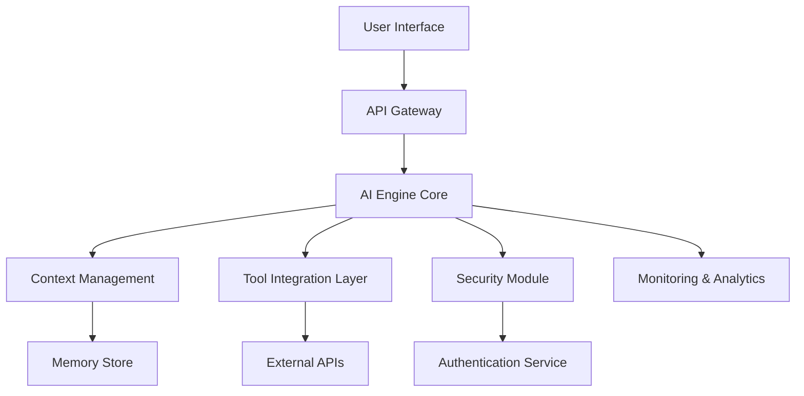

# Trae AI Technical Specifications

## 1. System Architecture Overview

### 1.1 Core Components
Trae AI is built on a modular architecture consisting of the following key components:

- **AI Engine Core**: Central processing unit for AI operations
- **Context Management System**: Handles conversation context and memory
- **Tool Integration Layer**: Manages external tool connections and API calls
- **Security & Authentication Module**: Ensures secure access and data protection
- **Monitoring & Analytics**: Real-time performance tracking and insights

### 1.2 Architecture Diagram


### 1.3 System Requirements

#### Minimum Requirements
- **CPU**: 4 cores, 2.5GHz
- **RAM**: 8GB
- **Storage**: 50GB SSD
- **Network**: 100 Mbps
- **OS**: Linux (Ubuntu 20.04+), Windows 10+, macOS 10.15+

#### Recommended Requirements
- **CPU**: 8 cores, 3.0GHz
- **RAM**: 16GB
- **Storage**: 100GB NVMe SSD
- **Network**: 1 Gbps
- **GPU**: NVIDIA RTX 3060 or equivalent (for enhanced performance)

### 1.4 Configuration

#### Environment Variables
Trae AI uses environment variables for configuration management through a `.env` file:

- **Application Port**: Defined by the `PORT` variable in `.env` file (default: 3333)
- **Database Configuration**: Connection strings and credentials
- **API Keys**: External service authentication tokens
- **Feature Flags**: Enable/disable specific functionality
- **Logging Level**: Control verbosity of application logs

#### Configuration Management
- **Environment Files**: `.env` for local development, `.env.production` for production
- **Configuration Validation**: Automatic validation of required environment variables on startup
- **Hot Reloading**: Dynamic configuration updates without service restart (where applicable)
- **Secrets Management**: Integration with external secret stores (HashiCorp Vault, AWS Secrets Manager)

#### Default Configuration
```env
PORT=3333
NODE_ENV=development
LOG_LEVEL=info
DATABASE_URL=postgresql://localhost:5432/trae_ai
REDIS_URL=redis://localhost:6379
```

## 2. Technical Components

### 2.1 AI Engine Core
The AI Engine Core is responsible for:
- Natural language processing and understanding
- Response generation and optimization
- Model inference and prediction
- Real-time learning and adaptation

**Key Features:**
- Multi-model support (GPT, Claude, Gemini)
- Dynamic model switching based on task requirements
- Intelligent prompt optimization
- Context-aware response generation

### 2.2 Context Management System
Manages conversation state and memory:
- **Short-term Memory**: Active conversation context
- **Long-term Memory**: Persistent user preferences and history
- **Semantic Memory**: Knowledge graph and entity relationships
- **Working Memory**: Temporary task-specific information

### 2.3 Tool Integration Layer
Enables seamless integration with external tools and services:
- **API Connectors**: RESTful and GraphQL API integrations
- **Database Connectors**: SQL and NoSQL database access
- **File System Access**: Local and cloud storage operations
- **Web Services**: HTTP/HTTPS service interactions

### 2.4 Security & Authentication
Comprehensive security framework:
- **OAuth 2.0/OpenID Connect**: Standard authentication protocols
- **Role-Based Access Control (RBAC)**: Granular permission management
- **Data Encryption**: AES-256 encryption for data at rest and in transit
- **Audit Logging**: Comprehensive activity tracking

## 3. Performance Specifications

### 3.1 Response Times
- **Simple Queries**: < 500ms
- **Complex Analysis**: < 2 seconds
- **Tool Integration**: < 3 seconds
- **File Operations**: < 5 seconds

### 3.2 Throughput
- **Concurrent Users**: Up to 1,000 simultaneous sessions
- **API Requests**: 10,000 requests per minute
- **Data Processing**: 1GB per minute

### 3.3 Availability
- **Uptime**: 99.9% SLA
- **Recovery Time**: < 30 seconds
- **Backup Frequency**: Every 6 hours
- **Disaster Recovery**: < 4 hours RTO

## 4. Integration Capabilities

### 4.1 Supported Platforms
- **Cloud Providers**: AWS, Azure, Google Cloud
- **Container Orchestration**: Kubernetes, Docker Swarm
- **CI/CD**: Jenkins, GitLab CI, GitHub Actions
- **Monitoring**: Prometheus, Grafana, DataDog

### 4.2 API Standards
- **REST API**: OpenAPI 3.0 compliant
- **GraphQL**: Full query and mutation support
- **WebSocket**: Real-time communication
- **gRPC**: High-performance RPC calls

## 5. Data Management

### 5.1 Data Storage
- **Primary Database**: PostgreSQL 13+
- **Cache Layer**: Redis 6+
- **File Storage**: S3-compatible object storage
- **Search Engine**: Elasticsearch 7+

### 5.2 Data Processing
- **Stream Processing**: Apache Kafka
- **Batch Processing**: Apache Spark
- **ETL Pipeline**: Apache Airflow
- **Data Validation**: JSON Schema validation

## 6. Scalability & Deployment

### 6.1 Horizontal Scaling
- **Load Balancing**: NGINX, HAProxy
- **Auto-scaling**: Kubernetes HPA
- **Database Sharding**: Automatic data partitioning
- **CDN Integration**: CloudFlare, AWS CloudFront

### 6.2 Deployment Options
- **On-Premises**: Full local deployment
- **Cloud-Native**: Kubernetes-based deployment
- **Hybrid**: Mixed on-premises and cloud
- **Edge Computing**: Distributed edge nodes

## 7. Monitoring & Observability

### 7.1 Metrics Collection
- **Application Metrics**: Response times, error rates
- **Infrastructure Metrics**: CPU, memory, disk usage
- **Business Metrics**: User engagement, feature usage
- **Custom Metrics**: Domain-specific KPIs

### 7.2 Logging & Tracing
- **Structured Logging**: JSON-formatted logs
- **Distributed Tracing**: OpenTelemetry integration
- **Log Aggregation**: ELK Stack (Elasticsearch, Logstash, Kibana)
- **Real-time Alerting**: PagerDuty, Slack integration

## 8. Security Specifications

### 8.1 Data Protection
- **Encryption Standards**: AES-256, RSA-4096
- **Key Management**: HashiCorp Vault
- **Data Masking**: PII anonymization
- **Compliance**: GDPR, CCPA, SOC 2 Type II

### 8.2 Network Security
- **TLS/SSL**: TLS 1.3 minimum
- **VPN Support**: WireGuard, OpenVPN
- **Firewall Rules**: Configurable IP whitelisting
- **DDoS Protection**: Rate limiting and traffic analysis

## 9. Development & Testing

### 9.1 Development Environment
- **Version Control**: Git with GitFlow
- **Code Quality**: SonarQube, ESLint
- **Testing Framework**: Jest, Pytest
- **Documentation**: Swagger/OpenAPI

### 9.2 Testing Strategy
- **Unit Testing**: 90%+ code coverage
- **Integration Testing**: API and service testing
- **Performance Testing**: Load and stress testing
- **Security Testing**: OWASP compliance

## 10. Maintenance & Updates

### 10.1 Update Mechanisms
- **Rolling Updates**: Zero-downtime deployments
- **Blue-Green Deployment**: Safe production updates
- **Feature Flags**: Gradual feature rollouts
- **Rollback Capability**: Quick reversion to previous versions

### 10.2 Maintenance Schedule
- **Security Patches**: Within 24 hours of release
- **Minor Updates**: Monthly release cycle
- **Major Updates**: Quarterly with advance notice
- **Emergency Fixes**: Immediate deployment when critical

This technical specification document provides the foundation for understanding Trae AI's architecture, capabilities, and requirements. For implementation details and API references, please refer to the accompanying documentation.