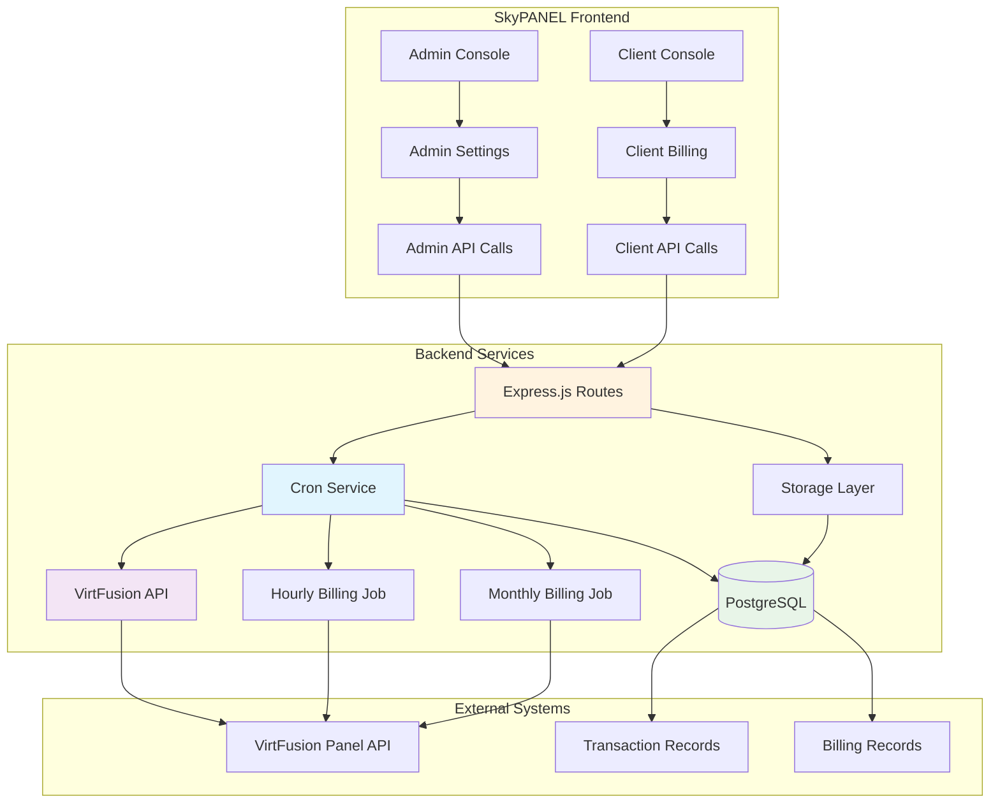
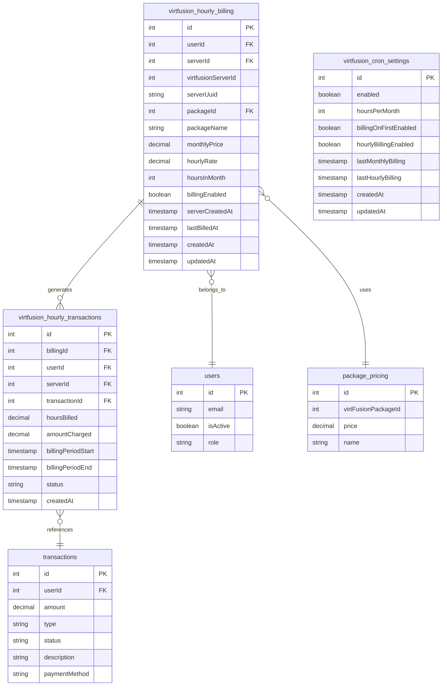
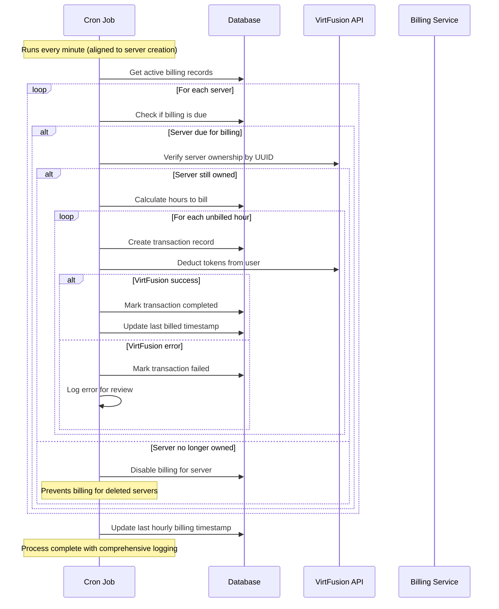
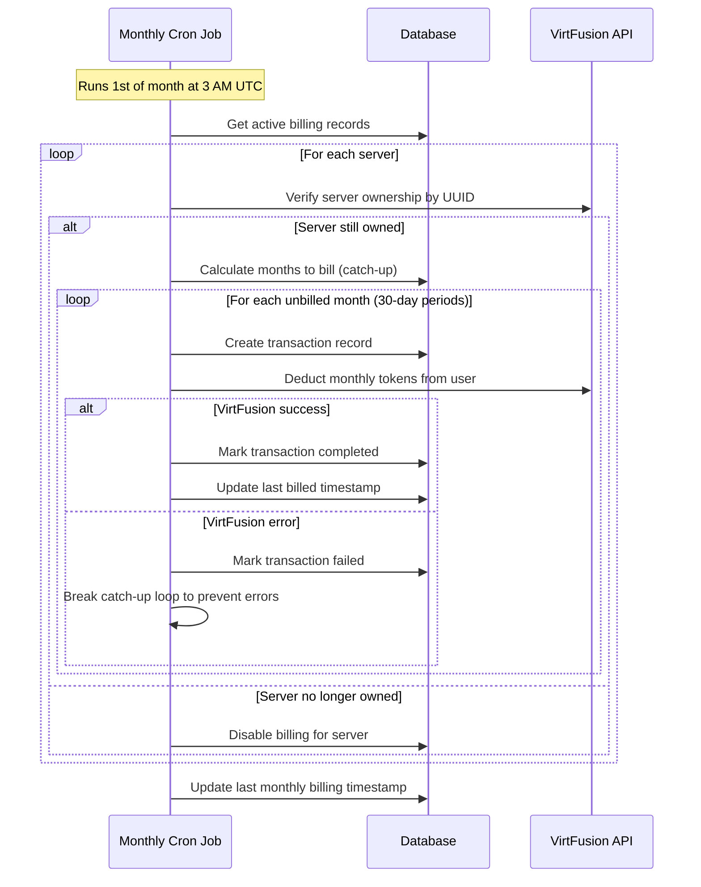
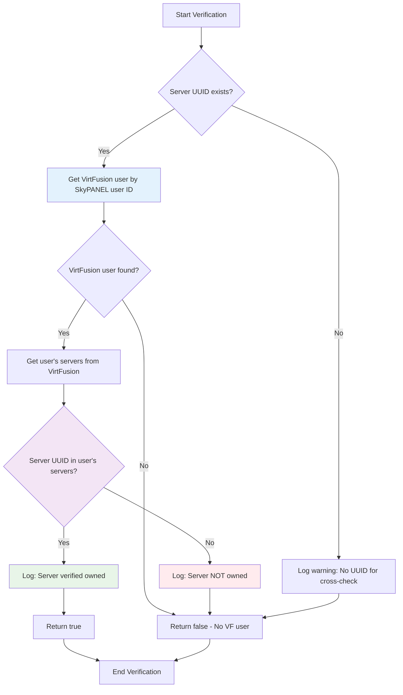

# VirtFusion Hourly/Monthly Billing Cron System

## Overview

The VirtFusion Billing System is a comprehensive automated billing solution that integrates with the VirtFusion VPS management API to provide real-time, usage-based billing for SkyPANEL users. The system supports both hourly and monthly billing modes with automatic server ownership verification, catch-up billing, and robust error handling.

## Architecture Overview



## Database Schema



## Billing Process Flows

### Hourly Billing Process



### Monthly Billing Process



### Server Ownership Verification Process



## API Endpoints

### Admin Endpoints

#### Cron Management

| Method | Endpoint | Description | Access |
|--------|----------|-------------|--------|
| `GET` | `/api/admin/cron/status` | Get status of all cron jobs | Admin |
| `POST` | `/api/admin/cron/virtfusion-billing/trigger-hourly` | Manually trigger hourly billing | Admin |
| `POST` | `/api/admin/cron/virtfusion-billing/trigger-monthly` | Manually trigger monthly billing | Admin |
| `GET` | `/api/admin/cron/virtfusion-billing/status` | Get VirtFusion billing status for all servers | Admin |

**Example Response - Cron Status:**
```json
{
  "success": true,
  "cronStatus": {
    "virtfusionHourly": {
      "isRunning": true,
      "enabled": true,
      "schedule": "* * * * *"
    },
    "virtfusionMonthly": {
      "isRunning": false,
      "enabled": false,
      "schedule": "0 3 1 * *"
    }
  }
}
```

#### VirtFusion Settings

| Method | Endpoint | Description | Access |
|--------|----------|-------------|--------|
| `POST` | `/api/admin/virtfusion/billing-mode/update` | Update billing mode (hourly/monthly) | Admin |
| `PUT` | `/api/admin/cron/virtfusion` | Update VirtFusion cron settings | Admin |

**Example Request - Update Billing Mode:**
```json
{
  "billingMode": "hourly"
}
```

### Client Endpoints

#### Billing Information

| Method | Endpoint | Description | Access |
|--------|----------|-------------|--------|
| `GET` | `/api/billing/balance` | Get account balance information | Authenticated |
| `GET` | `/api/billing/usage/last30days` | Get usage data for last 30 days | Authenticated |
| `GET` | `/api/billing/transactions` | Get user's billing transactions | Authenticated |
| `GET` | `/api/transactions/:id` | Get specific transaction details | Authenticated |

**Example Response - Balance:**
```json
{
  "credits": 125.50,
  "virtFusionCredits": 125.00,
  "virtFusionTokens": 12500.00
}
```

**Example Response - Usage:**
```json
{
  "usage": 25.5,
  "rawData": {
    "period": "May 2025",
    "monthlyTotal": {
      "hours": 255,
      "value": "25.50",
      "tokens": false
    }
  }
}
```

#### Server Management

| Method | Endpoint | Description | Access |
|--------|----------|-------------|--------|
| `GET` | `/api/servers` | Get user's servers | Authenticated |
| `GET` | `/api/servers/:id/billing` | Get server billing details | Authenticated |
| `POST` | `/api/servers/:id/billing/disable` | Disable billing for server | Authenticated |

### API Keys & Scopes

The system supports API key authentication with the following billing-related scopes:

- `read:billing` - View billing history, invoices, and credit balance
- `write:billing` - Add credits and manage billing settings
- `admin:billing` - Administrative access to billing functions (admin only)

**Example API Key Usage:**
```bash
curl -H "Authorization: Bearer your-api-key" \
     -H "Content-Type: application/json" \
     https://api.skypanel.com/api/v1/balance
```

## Cron Service Configuration

### Billing Modes

The system supports two billing modes, controlled by the `virtfusion_self_service_hourly_credit` setting:

1. **Hourly Billing** (`true`) - Bills users based on actual server uptime hours
2. **Monthly Billing** (`false`) - Bills users monthly regardless of usage

### Cron Schedules

| Job Type | Schedule | Description |
|----------|----------|-------------|
| Hourly Billing | `* * * * *` | Every minute (aligned to server creation time) |
| Monthly Billing | `0 3 1 * *` | 1st day of month at 3 AM UTC |

### Settings Configuration

Cron settings are stored in the `virtfusion_cron_settings` table:

```sql
-- Enable/disable cron system globally
enabled: boolean (default: false)

-- Hours per month for rate calculation
hoursPerMonth: integer (default: 730)

-- Enable monthly billing on 1st of month
billingOnFirstEnabled: boolean (default: true)

-- Enable hourly billing mode
hourlyBillingEnabled: boolean (default: true)
```

## Recent Changes & Improvements

### Server Ownership Verification Fix

**Problem:** The system was incorrectly billing users for servers they no longer owned.

**Solution:** Implemented UUID-based server ownership verification:

1. **Enhanced Verification Logic**: Added `verifyServerOwnershipByUuid()` method
2. **User ID Mapping**: Properly converts SkyPANEL user IDs to VirtFusion user IDs
3. **Automatic Billing Disabling**: Automatically disables billing when servers are deleted
4. **Comprehensive Logging**: Added detailed logging for all verification steps

**Impact:**
- ✅ Prevents incorrect billing for deleted servers
- ✅ Automatic cleanup of stale billing records
- ✅ Improved accuracy of billing transactions
- ✅ Enhanced audit trail with detailed logging

### Billing Mode Management

**Enhancement:** Dynamic billing mode switching based on system settings.

**Features:**
1. **Automatic Mode Detection**: Reads `virtfusion_self_service_hourly_credit` setting
2. **Dynamic Cron Jobs**: Starts appropriate cron jobs based on billing mode
3. **Seamless Switching**: Admin can switch between hourly/monthly billing
4. **Startup Initialization**: Correctly initializes billing mode on server startup

### Error Handling Improvements

**Enhancements:**
1. **Graceful API Failures**: System continues processing other servers on API errors
2. **Transaction Safety**: All billing operations are wrapped in proper error handling
3. **Comprehensive Logging**: Detailed success/failure logging with context
4. **Admin Notifications**: Failed operations are logged for admin review

## Frontend Integration

### Admin Settings Page

Located at `/client/src/pages/admin/settings-page.tsx`, the admin interface provides:

1. **VirtFusion Configuration**:
   - API URL and token settings
   - SSL verification toggle
   - Billing mode selection

2. **Cron Management**:
   - Enable/disable cron jobs
   - Manual trigger buttons
   - Status monitoring

3. **Billing Settings**:
   - Hours per month configuration
   - Schedule customization
   - Debug and testing tools

### Client Dashboard

The client-facing interface provides:

1. **Billing Overview**: Current balance and usage statistics
2. **Transaction History**: Detailed billing transactions
3. **Server Billing**: Per-server billing information
4. **Usage Analytics**: Historical usage patterns

## Database Operations

### Storage Layer Integration

All database operations go through the centralized storage layer (`server/storage.ts`):

```typescript
// Create billing record
await storage.createVirtFusionBilling({
  userId: user.id,
  serverId: server.id,
  virtfusionServerId: server.virtfusionId,
  packageId: server.packageId,
  monthlyPrice: server.monthlyPrice
});

// Update billing status
await storage.updateVirtFusionBilling(billingId, {
  billingEnabled: false,
  updatedAt: new Date()
});

// Create transaction
await storage.createTransaction({
  userId: user.id,
  amount: -hourlyRate,
  description: `VirtFusion Server ${serverId} - Hourly Billing`,
  type: "debit",
  status: "completed"
});
```

### Migration Scripts

Migration scripts are located in the `scripts/` directory:

- `scripts/check-virtfusion-cron-settings.ts` - Verify cron configuration
- `scripts/disable-virtfusion-cron.ts` - Emergency cron disable

## Security Considerations

### Access Control

1. **Admin-Only Endpoints**: Cron management restricted to admin users
2. **User Isolation**: Billing records filtered by user ownership
3. **API Key Scopes**: Granular permissions for API access
4. **Transaction Validation**: All financial operations validated before processing

### Data Protection

1. **Server Ownership Verification**: Prevents cross-user billing
2. **Transaction Integrity**: Atomic operations for billing processes
3. **Audit Logging**: Comprehensive logging of all billing activities
4. **Error Boundaries**: Isolated error handling prevents system-wide failures

## Monitoring & Troubleshooting

### Health Checks

1. **Cron Status Endpoint**: Real-time job status monitoring
2. **Billing Status Dashboard**: Server-by-server billing status
3. **Transaction Monitoring**: Failed transaction detection
4. **VirtFusion API Health**: Connection status monitoring

### Debug Tools

1. **Manual Triggers**: Admin can manually trigger billing runs
2. **Billing Status Reports**: Detailed server billing information
3. **Transaction History**: Complete audit trail of all operations
4. **Error Logs**: Centralized error reporting and analysis

### Common Issues

| Issue | Cause | Solution |
|-------|--------|----------|
| Servers not being billed | Billing disabled or server ownership change | Check server ownership and billing status |
| Failed transactions | VirtFusion API errors or insufficient credits | Review error logs and user balance |
| Cron jobs not running | Service restart or configuration change | Check cron status and restart if needed |
| Duplicate billing | Clock synchronization or restart during billing | Review transaction history for duplicates |

## Future Enhancements

### Planned Features

1. **Advanced Scheduling**: More granular cron timing options
2. **Billing Reports**: Detailed analytics and reporting dashboard
3. **Notification System**: Email and Discord alerts for billing events
4. **Custom Billing Rates**: Per-server or per-user rate customization
5. **Billing Predictions**: Usage forecasting and budget alerts

### Performance Optimizations

1. **Batch Processing**: Process multiple servers in parallel
2. **Caching Layer**: Cache server data to reduce API calls
3. **Database Indexing**: Optimize queries for large datasets
4. **Rate Limiting**: Implement VirtFusion API rate limiting

## Conclusion

The VirtFusion Billing System provides a robust, scalable solution for automated VPS billing with comprehensive error handling, security features, and administrative controls. The system's dual-mode operation (hourly/monthly), server ownership verification, and extensive API integration make it suitable for production environments with real-time billing requirements.

The recent improvements in server ownership verification and billing mode management ensure accurate billing while providing administrators with the flexibility to configure the system according to their business requirements.