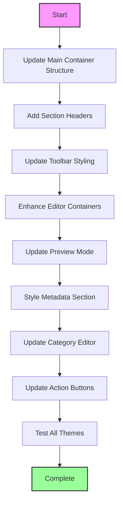

# Monaco Editor Update Plan - Blog Page to Match Docs Page

## Overview
This plan details the complete styling update for the blog page Monaco editor to match the docs page editor appearance, including the category editor section.

## Current State Analysis

### Blog Page (`/admin/blog`)
- Basic borders and simple styling
- Less polished toolbar appearance
- Standard gray backgrounds
- Minimal container styling
- Two editors: content editor and category editor

### Docs Page (`/admin/docs`)
- Polished containers with shadows and rounded corners
- Professional toolbar with better hover effects
- Consistent dark/light theme implementation
- Better visual hierarchy with section headers
- Single editor with enhanced styling

## Implementation Plan

### Phase 1: Container Structure Updates

#### 1.1 Main Container Wrapper
Replace current wrapper:
```tsx
// FROM:
<div className="border border-gray-300 dark:border-gray-700 rounded-lg overflow-hidden">

// TO:
<div className="bg-white dark:bg-gray-950 rounded-xl shadow-lg overflow-hidden">
```

#### 1.2 Editor Section Headers
Add section headers with brand colors:
```tsx
// Add for Content Editor:
<div className="bg-gradient-to-r from-purple-500 to-indigo-600 text-white px-4 py-2">
  <div className="flex items-center gap-2">
    <FileText className="w-4 h-4" />
    <span className="font-medium">Content Editor</span>
  </div>
</div>

// Add for Category Editor:
<div className="bg-gradient-to-r from-purple-500 to-indigo-600 text-white px-4 py-2">
  <div className="flex items-center gap-2">
    <Tag className="w-4 h-4" />
    <span className="font-medium">Category Content</span>
  </div>
</div>
```

### Phase 2: Toolbar Styling Updates

#### 2.1 Toolbar Container
Update toolbar styling:
```tsx
// FROM:
<div className="bg-gray-100 dark:bg-gray-800 p-2 border-b border-gray-300 dark:border-gray-700">

// TO:
<div className="sticky top-0 z-10 bg-gray-50 dark:bg-gray-900 border-b border-gray-200 dark:border-gray-800">
  <div className="px-4 py-2">
```

#### 2.2 Button Styling
Enhance button appearance:
```tsx
// FROM:
className="p-1 hover:bg-gray-200 dark:hover:bg-gray-700 rounded"

// TO:
className="p-2 hover:bg-gray-200 dark:hover:bg-gray-700 rounded-lg transition-colors"
```

#### 2.3 Button Groups
Add visual separation:
```tsx
// Wrap button groups in:
<div className="flex items-center gap-1 px-2 border-r border-gray-200 dark:border-gray-700 last:border-r-0">
  {/* buttons */}
</div>
```

### Phase 3: Editor Container Updates

#### 3.1 Editor Wrapper
Add proper container styling:
```tsx
// Wrap each Monaco Editor in:
<div className="border border-gray-200 dark:border-gray-800 rounded-lg overflow-hidden">
  <Editor ... />
</div>
```

#### 3.2 Background Colors
Ensure consistent backgrounds:
```tsx
// Add to editor containers:
className="bg-white dark:bg-gray-900"
```

### Phase 4: Preview Mode Enhancement

#### 4.1 Preview Container
Update preview styling:
```tsx
// FROM:
<div className="p-4 prose prose-sm dark:prose-dark max-w-none">

// TO:
<div className="p-6 bg-white dark:bg-gray-900">
  <div className="prose prose-sm dark:prose-invert max-w-none 
    prose-headings:text-gray-900 dark:prose-headings:text-gray-100
    prose-p:text-gray-700 dark:prose-p:text-gray-300
    prose-a:text-purple-600 dark:prose-a:text-purple-400
    prose-code:text-purple-700 dark:prose-code:text-purple-300">
```

### Phase 5: Metadata Section Update

#### 5.1 Form Fields Container
Update the metadata section styling:
```tsx
// Apply consistent container styling:
<div className="bg-white dark:bg-gray-950 rounded-xl shadow-lg p-6">
  {/* form fields */}
</div>
```

#### 5.2 Input Styling
Ensure inputs match the docs page style:
```tsx
// Update input classes to:
className="w-full px-4 py-2 rounded-lg border border-gray-300 dark:border-gray-700 
  bg-white dark:bg-gray-900 text-gray-900 dark:text-gray-100
  focus:ring-2 focus:ring-purple-500 focus:border-transparent"
```

### Phase 6: Category Editor Alignment

Apply the same styling patterns to the category editor:
1. Add section header with gradient
2. Update toolbar styling
3. Apply consistent container borders and backgrounds
4. Ensure proper dark/light theme support

### Phase 7: Action Buttons Update

#### 7.1 Button Styling
Update action buttons to match docs page:
```tsx
// Primary button (Create/Update):
className="px-6 py-2 bg-gradient-to-r from-purple-500 to-indigo-600 
  text-white font-medium rounded-lg hover:from-purple-600 hover:to-indigo-700 
  transition-all duration-200 shadow-lg"

// Secondary button (Cancel):
className="px-6 py-2 bg-gray-200 dark:bg-gray-800 text-gray-700 
  dark:text-gray-300 font-medium rounded-lg hover:bg-gray-300 
  dark:hover:bg-gray-700 transition-colors"
```

## Testing Checklist

- [ ] Verify dark mode styling consistency
- [ ] Check line numbers visibility in both themes
- [ ] Test toolbar button hover effects
- [ ] Verify preview mode styling
- [ ] Check category editor appearance
- [ ] Test responsive behavior
- [ ] Verify all form inputs styling
- [ ] Check shadow and border consistency

## Additional Considerations

1. **Performance**: Ensure smooth transitions and no layout shifts
2. **Accessibility**: Maintain proper contrast ratios in both themes
3. **Consistency**: Apply the same patterns throughout the page
4. **Maintainability**: Use consistent class naming patterns

## Implementation Order



## Expected Outcome

After implementation:
- Blog editor will have the same polished appearance as docs editor
- Consistent dark/light theme support
- Professional toolbar with proper hover effects
- Enhanced visual hierarchy with section headers
- Improved user experience with better styling